<div align="center">
  
</div>

<div align="center">

[](https://ashutosh-portfolio09.vercel.app)
[](https://ashutosh-portfolio09.vercel.app/resume.pdf)
[](https://www.linkedin.com/in/ashutosh-singh2024)
[](https://www.kaggle.com/ashyou09)
[](https://leetcode.com/u/ash_you09/)
[](mailto:ashutosh.singh2024@nst.rishihood.edu.in)

</div>

---

## About

I work where reinforcement learning and large language models meet. Most of what I build is **agentic**: multi-node LangGraph pipelines, retrieval and tool-use workflows, and classical ML doing the parts that don't need a transformer.

Alongside that I ship product — two internships taught me the unglamorous half of engineering: containers, auth, image pipelines, and talking to clients about scope.

```
Education    B.Tech, Artificial Intelligence · Newton School of Technology,
             Rishihood University · 2024–2028 · 8.1 / 10.0 CGPA
Currently    AI Intern @ SWOT Automations — agentic workflows on Claude + MCP,
             and a Three.js 3D visualisation track
Focus        LLM agents · applied ML · reinforcement learning · real-time 3D
```

---

## Selected Work

| Project | What it does | Stack |
|:--|:--|:--|
| **[Contract Risk Analysis](https://github.com/ashyou09/Contract-Risk-Classification)** · [live](https://contract-risk-classification.streamlit.app) | A LangGraph agent isolates every clause in a contract and flags legal risk. Routing is agentic; scoring is a tuned logistic regression at **0.8859 F1** — faster and far cheaper than grading each clause with an LLM. | `LangGraph` `scikit-learn` `Ollama` `Streamlit` |
| **[Port Digital Twin](https://github.com/ashyou09/3D-Port-visulaization)** · [live](https://3-d-port-visulaization-cyan.vercel.app) | Browser-native 3D twin of the Eastern Arm terminal at Visakhapatnam Port. **400+ vehicles** drive real Catmull-Rom splines through a 24-hour cycle with night and rain states. | `Three.js` `R3F` `drei` `Zustand` |
| **[AI Research Assistant](https://github.com/ashyou09/ai-intern-final-ashutosh-singh)** · [live](https://ai-intern-final-ashutosh-singh.vercel.app/) | Real-time web and academic search synthesised by an LLM and exported as a formatted PDF. Search runs through an **MCP** tool server; models fail over OpenRouter → Groq; results stream over SSE. | `FastAPI` `MCP` `Groq` `fpdf2` |
| **[Hybrid RL-LLM Explorer](https://github.com/ashyou09/Hybrid_RL_LLM_Explorer)** · [live](https://huggingface.co/spaces/ashyou09/hybrid-rl-llm-explorer) | An agent survives a lava grid by pairing greedy RL exploration with LLM semantic generalisation — it learns *"red lava is bad"* rather than *"tile (3,4) is bad"*, deliberately dropping coordinates from the learning log. | `MiniGrid` `Streamlit` `LLM` `RL` |
| **[Interview Agent](https://github.com/ashyou09/interview-agent)** · [live](https://ai-interview-agent-1974.vercel.app) | Generates a role-specific question set, then conducts the interview by voice. Gemini handles generation and follow-ups, Vapi handles the call, LangGraph keeps state coherent between turns. | `Next.js` `Gemini` `Vapi` `Firebase` |
| **[EstateVerse](https://github.com/ashyou09/Realty-AI-Price-Persona-Predictor)** · [live](https://realestate-ml-model.vercel.app) | Property price and buyer-persona predictor served from a FastAPI model, so an agent gets both a valuation and a targeting hint from one form. | `FastAPI` `scikit-learn` `React` |

<details>
<summary><b>More projects</b></summary>

<br>

| Project | What it does | Stack |
|:--|:--|:--|
| **[Eats](https://github.com/ashyou09/Eats)** · [live](https://eatindia.vercel.app) | Full MERN food-delivery platform — restaurant discovery with filtering and pagination, a cart scoped to one restaurant that debounce-syncs to MongoDB, JWT auth on email or phone, order tracking. Class-based TypeScript backend. | `React` `TypeScript` `Express` `MongoDB` |
| **[BookScan](https://github.com/ashyou09/BOOKSCANS)** · [live](https://bookscans.vercel.app) | A reading library for PDFs and textbooks with a custom canvas PDF engine, webtoon and single-page modes, and reading position synced to the exact page across devices. | `Next.js` `pdfjs-dist` `Zustand` |
| **[Note Weiver](https://github.com/ashyou09/Note_weiver)** · [live](https://huggingface.co/spaces/ashyou09/Notes_weiver) | Note-review tooling deployed as a Hugging Face Space. | `Rust` `HF Spaces` |
| **[Photo to JSON](https://github.com/ashyou09/json.convertor)** · [live](https://ashyou09.github.io/json.convertor/) | Pulls text out of an uploaded image and returns it as structured JSON. | `React` `OCR` |
| **[Portfolio](https://github.com/ashyou09/portfolio)** · [live](https://ashutosh-portfolio09.vercel.app) | This site — a live MLP training in-browser, an interactive 3D transformer block, and a trimmed port digital twin, all real-time WebGL. | `React 19` `Three.js` `Motion` `Vite` |

</details>

---

## Toolkit

**AI / ML**
&nbsp;


**Web & 3D**
&nbsp;


**Data & Infra**
&nbsp;


---

## Certifications

| Issuer | Credential | Covers | |
|:--|:--|:--|:--|
| **Anthropic** | AI Certifications *(4 tracks)* | Agent Skills · Claude Coding · API Integration · MCP | [verify](https://drive.google.com/drive/folders/1DCbrsvjzLoHsaI0hrZo-jOnvxF8avVhG?usp=drive_link) |
| **Stanford · DeepLearning.AI** | Machine Learning Specialization | Supervised learning · Advanced algorithms · Unsupervised learning | [verify](https://coursera.org/verify/specialization/9SW3BWV2SFGB) |

---

## Activity

<div align="center">


</div>

---

<div align="center">
<sub>Open to AI / ML internships and research collaborations · <a href="mailto:ashutosh.singh2024@nst.rishihood.edu.in">ashutosh.singh2024@nst.rishihood.edu.in</a></sub>
</div>
